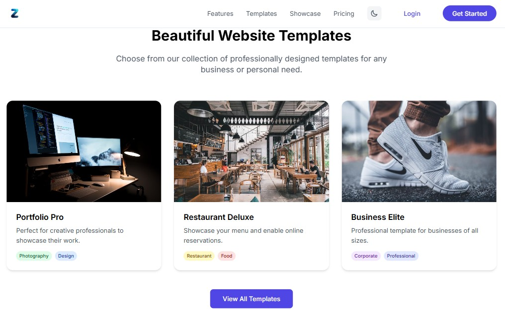

# Zylo

<p align="center">
  
</p>

<p align="center">
  <a href="https://github.com/kushal1o1/Zylo/stargazers"></a>
  <a href="https://github.com/kushal1o1/Zylo/network/members"></a>
  <a href="https://github.com/kushal1o1/Zylo/pulls"></a>
  <a href="https://github.com/kushal1o1/Zylo/issues"></a>
  <a href="https://github.com/kushal1o1/Zylo/graphs/contributors"></a>
</p>

<p align="center">
  <b>ZYLO is built using Django and Tailwind CSS to create a professional and responsive landing website .</b>
</p>

<p align="center">
  <a href="#features">Features</a> •
  <a href="#demo">Demo</a> •
  <a href="#installation">Installation</a> •
  <a href="#usage">Usage</a> •
  <a href="#configuration">Configuration</a> •
  <a href="#api-reference">API Reference</a> •
  <a href="#documentation">Documentation</a> •
  <a href="#roadmap">Roadmap</a> •
  <a href="#contributing">Contributing</a> •
  <a href="#license">License</a> •
  <a href="#contact">Contact</a> •
  <a href="#acknowledgments">Acknowledgments</a>
</p>


## Overview

ZYLO is a versatile, multi-purpose landing website that can serve various use cases:

Personal portfolios
Business or company landing pages
Hotels, restaurants, and local businesses
A consolidated site for all your social media and web links
ZYLO is built using Django and Tailwind CSS to create a professional and responsive website with an easy-to-manage backend.

## Features

- **User Authentication: Secure login and profile management. Using allauth**
- **Profile Management: Edit profile details, social links, bio, and upload images.**
- **Highlights Section: Add up to 7 highlights with automatic management (oldest is deleted when the limit is reached).**
- **Dynamic Sections: Add content sections for services, projects, or any other information.**
- **Responsive Design: Mobile-friendly with Tailwind CSS.**
- **Media Uploads: Upload images for highlights, sections, and profiles.**
- **NO need Hosting:auto deployed with providing its url**


## Demo

<p align="center">
  
</p>

## Screenshot



## Installation
```bash
# Clone the repository
git clone https://github.com/kushal1o1/Zylo.git

# Navigate to the project directory
cd Zylo


pip install -r requirements.txt
```

### Prerequisites
- **Python 3.x**
- **pip**
- **django**
- **virtualenv**
- **Refer requirements.txt**

## Usage

```bash
python manage.py makemigrations

python manage.py migrate

python manage.py runserver
```

## Using Docker
```bash
docker-compose up --build
```

## Configuration


### Environment Variables

| Variable | Description | Default |
|----------|-------------|---------|
| `SECRET_KEY` | secretKey for django | `any` |
| `Refer` | .env.example  provided in codebase | `.env` |

## Directory Structure

```
Zylo/
├─] .env (ignored)
├── .env.example
├── .gitignore
├── CODE_OF_CONDUCT.md
├── CONTRIBUTING.md
├─] db.sqlite3 (ignored)
├─] env/ (ignored)
├── manage.py
├─] media/ (ignored)
├── portfolios/
│   ├── admin.py
│   ├── apps.py
│   ├── forms.py
│   ├── migrations/
│   │   ├── __init__.py
│   │   └── __pycache__/
│   ├── models.py
│   ├── services.py
│   ├── static/
│   │   └── images/
│   ├── templatetags/
│   │   ├── custom_tags.py
│   │   ├── __init__.py
│   │   └── __pycache__/
│   │       ├── custom_tags.cpython-312.pyc
│   │       └── __init__.cpython-312.pyc
│   ├── tests.py
│   ├── urls.py
│   ├── views.py
│   ├── __init__.py
│   └── __pycache__/
├── README.md
├── requirements.txt
├── standards.md
├── staticfiles/

├── templates/
│   ├── animated/
│   ├── designs/
│   ├── highlight_list.html
│   ├── MainPage/
│   │   ├── Base.html
│   │   ├── index.html
│   │   └── loader.html
│   ├── Notfound.html
│   ├── portfolio/
│   │   ├── codesnippet.html
│   │   ├── index.html
│   │   ├── main-info-phone.html
│   │   ├── portfolioServer.html
│   │   └── section_form.html
│   └── Section_list.html
├── Test.html
├── TODO.py
└── ZYLO/
    ├── asgi.py
    ├── settings.py
    ├── urls.py
    ├── wsgi.py
    ├── __init__.py
```

## Technologies Used

<p align="center">


</p>

## Contributing

Contributions are what make the open source community such an amazing place to learn, inspire, and create. Any contributions you make are **greatly appreciated**.

1. Fork the Project
2. Create your Feature Branch (`git checkout -b feature/AmazingFeature`)
3. Commit your Changes (`git commit -m 'Add some AmazingFeature'`)
4. Push to the Branch (`git push origin feature/AmazingFeature`)
5. Open a Pull Request

Please make sure to update tests as appropriate and adhere to the [code of conduct](CODE_OF_CONDUCT.md).

## License

This project is licensed under the MIT License.

## Contact

Your Name - [@kushal1o1](https://twitter.com/kushal1o1) - share.kusal@gmail.com

---

<p align="center">
  Made with ❤️ by <a href="https://github.com/kushal1o1/MDFileCreator">MdCreator</a>
</p>
